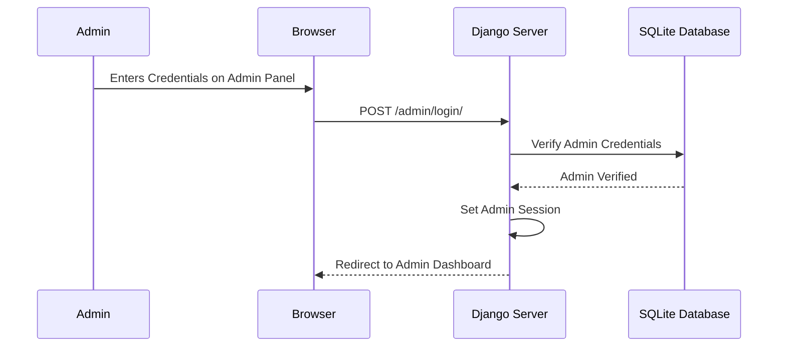
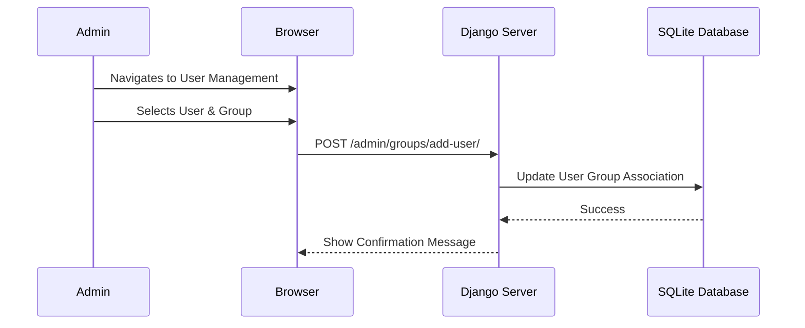

# Admin Process Flow

This document details the administrative management process based on the `admin-flow.feature` Cypress tests.

## 1. Admin Login Process

## 2. Group Management (User Assignment)

