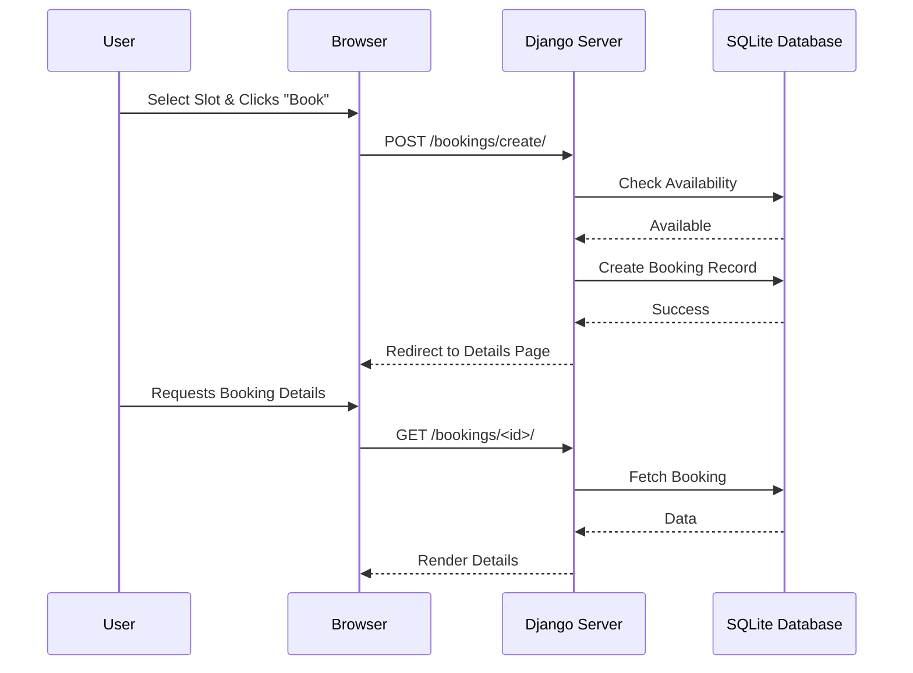
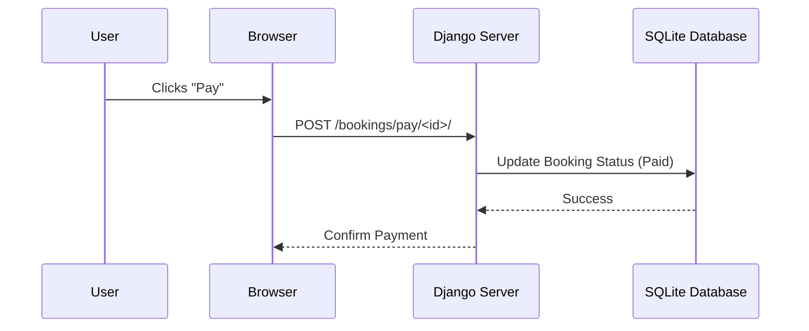

# Booking Process Flow

This document details the court reservation and management process based on the `booking-flow.feature` Cypress tests.

## 1. Create and View Booking

## 2. Process Payment

