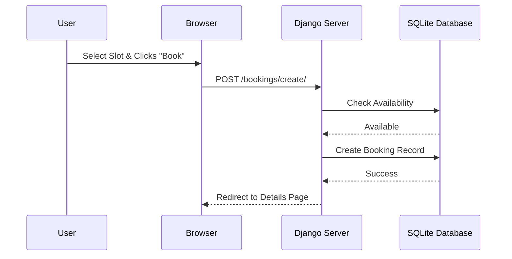
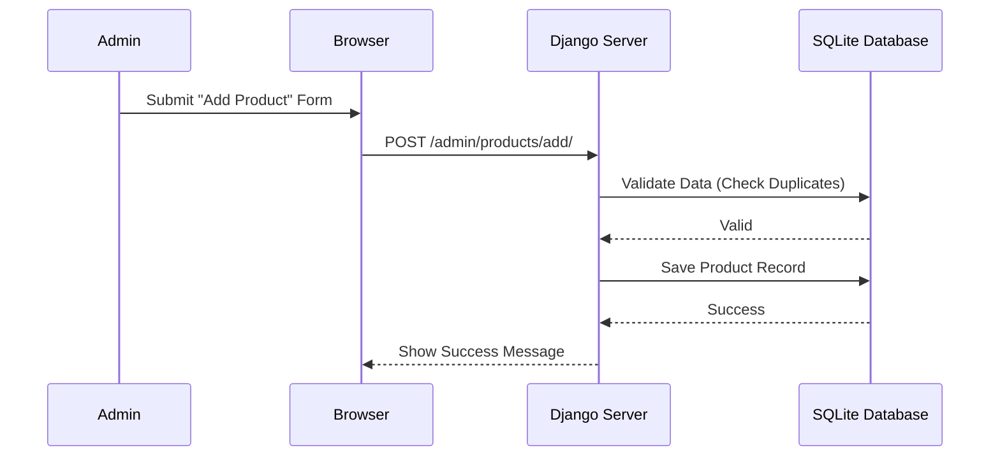
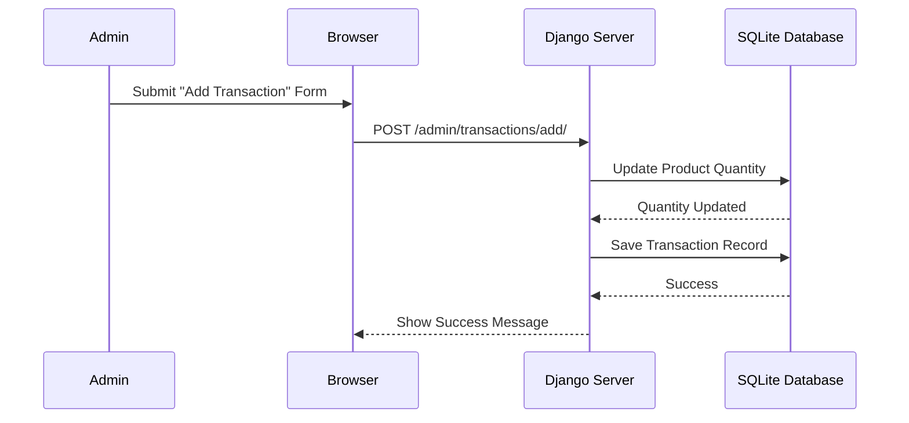
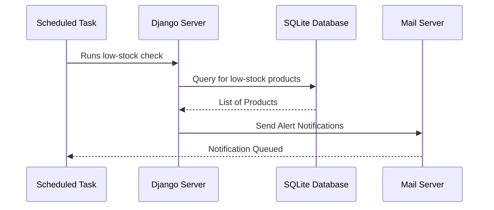

# Booking & Inventory Flows

This document details the court reservation, inventory management, and stock tracking processes based on the `booking-flow.feature` and `inventory.feature` Cypress tests.

## 1. Booking Management

## 2. Inventory Product Management

## 3. Inventory Stock Transaction

## 4. Low-Stock Alert System

