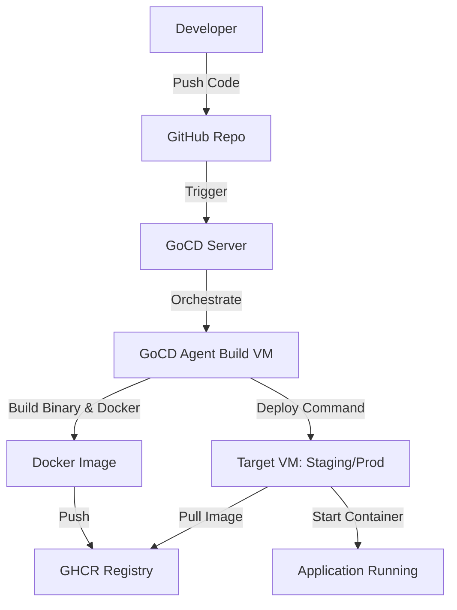
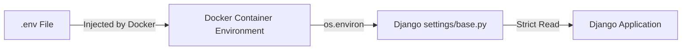
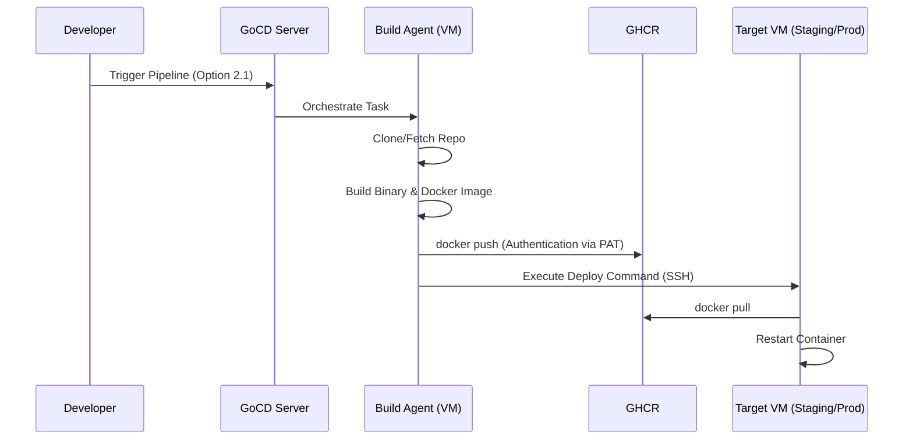
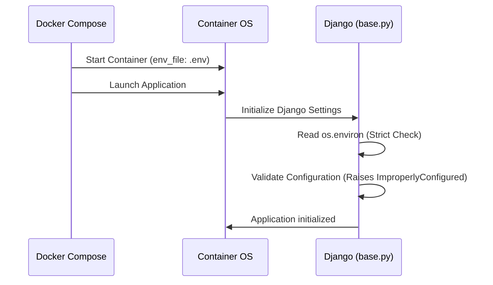

# Process Flows: Badminton Court

This document serves as the visual reference for the core infrastructure and configuration processes of the `badminton_court` project.

---

## 1. CI/CD Deployment Flow (High-Level)
This diagram illustrates the progression from code change to active deployment.

---

## 2. Configuration Loading Flow (High-Level)
This diagram illustrates how environment variables are injected into the Django application.

---

## 3. End-to-End Deployment Sequence
This diagram details the interaction between components during a deployment operation triggered by the developer.

---

## 4. Configuration Initialization Sequence
This diagram details how the application environment is initialized upon container startup.

