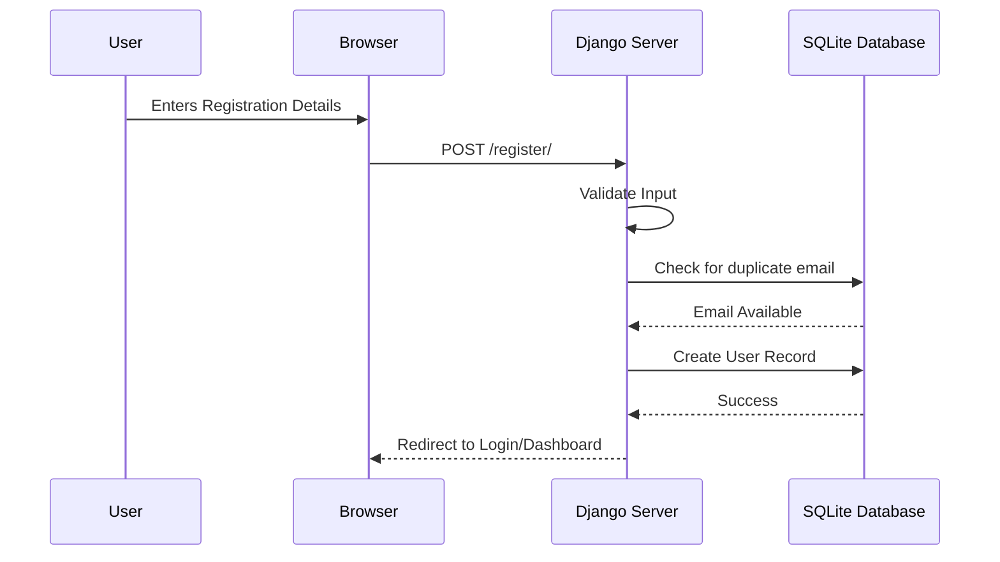
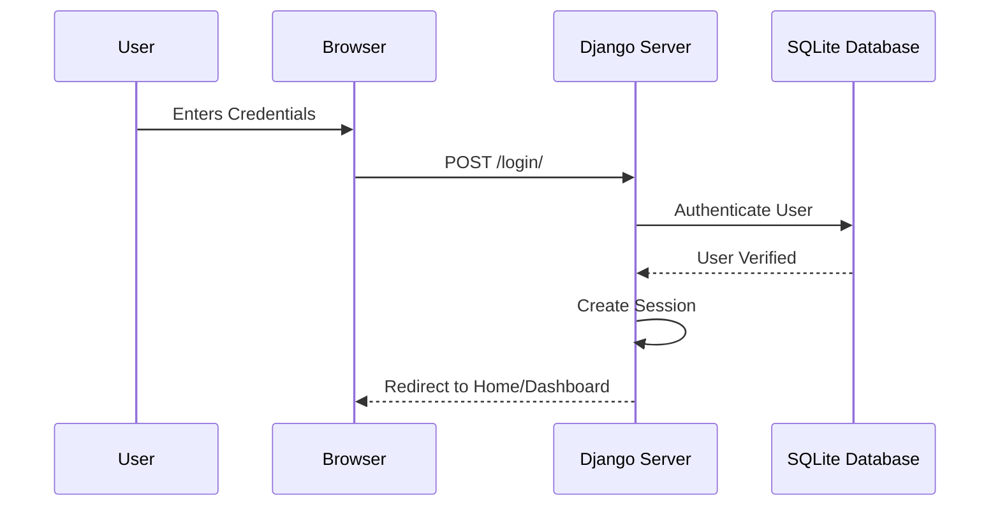

# SignUp and SignIn Process Flow

This document details the authentication process for the Badminton Court application based on the `auth-flow.feature` Cypress tests.

## 1. Registration Process

## 2. Login Process

