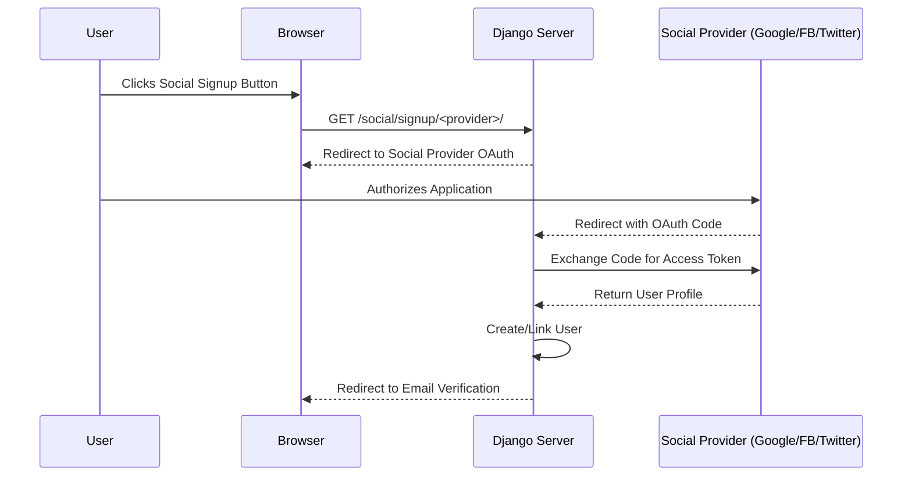
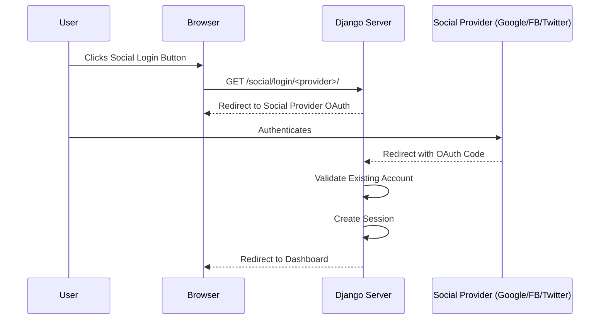

# Social Auth Process Flow

This document details the social media authentication process based on the `social-auth.feature` Cypress tests.

## 1. Social Media Sign Up Flow

## 2. Social Media Sign In Flow

